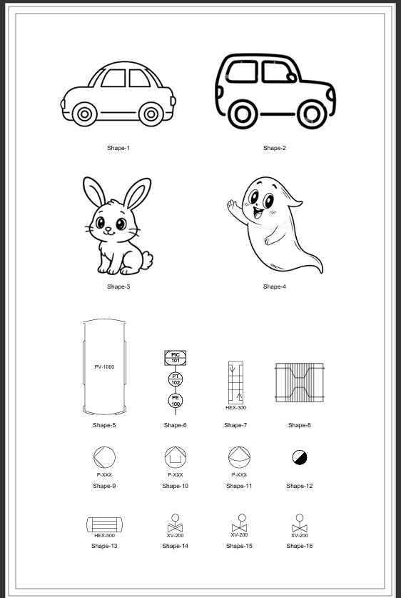
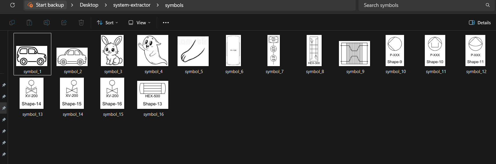
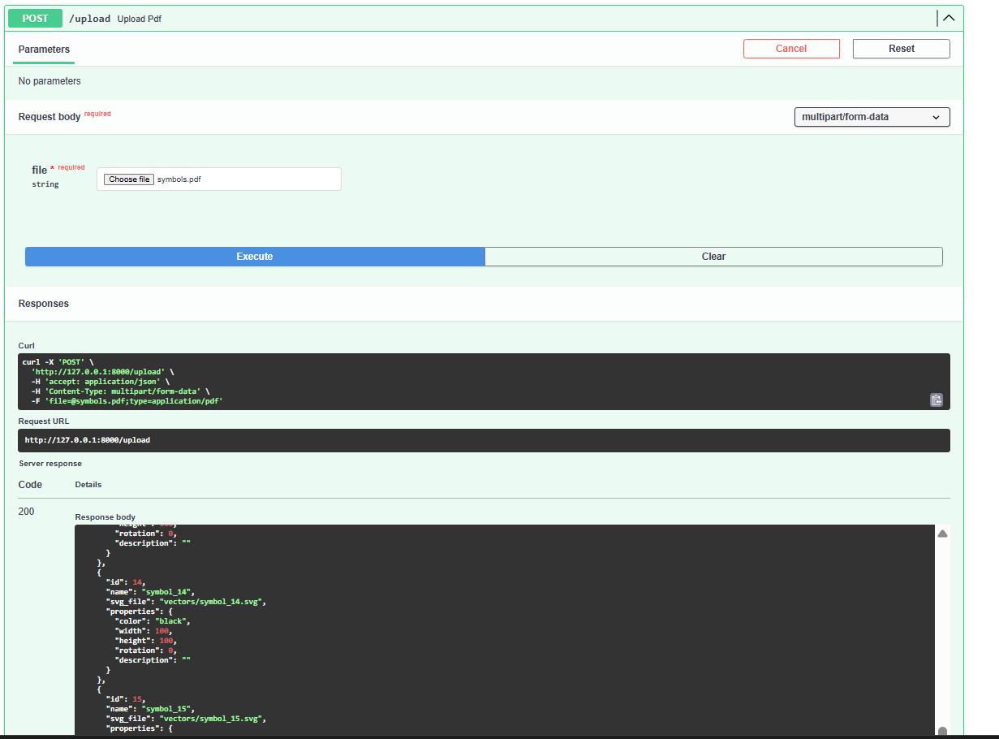
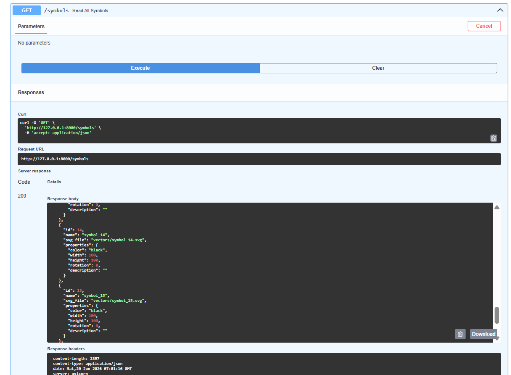
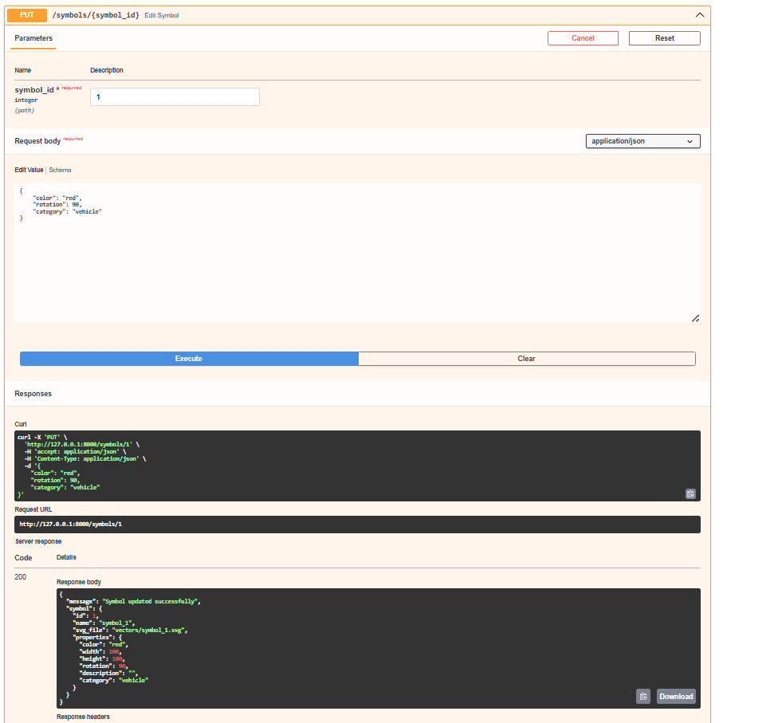

# AI Symbol Extraction & Vectorization System

## Overview

This project is an AI-assisted backend system that extracts symbols from a PDF document, converts them into editable vector representations, and allows custom properties to be assigned to each symbol.

The system processes engineering symbols, icons, and drawings from a PDF and transforms them into structured SVG assets with editable metadata.

---

## Features

- Upload PDF files through REST API
- Convert PDF pages into high-resolution images
- Automatically detect and extract individual symbols using OpenCV
- Remove noise and isolate symbol boundaries
- Convert raster PNG symbols into scalable SVG vector files
- Store symbol information with customizable properties
- Retrieve and update symbols using REST APIs
- Interactive API documentation using Swagger UI

---

## System Architecture

```
                PDF Document
                      |
                      v
              PyMuPDF Renderer
                      |
                      v
                Page Images
                      |
                      v
             OpenCV Processing
                      |
                      v
             Symbol Segmentation
                      |
                      v
              Cropped PNG Symbols
                      |
                      v
               SVG Vectorization
                      |
                      v
             Metadata Generation
                      |
                      v
                  FastAPI APIs
```

## Results

### Input PDF



### Extracted Symbols



### API Documentation

#### POST /upload (Upload Pdf)


#### GET /symbols(Read all symbols)


#### PUT /symbols/{symbols_id} (Edit symbol)



---

## Tech Stack

### Backend

- Python 3.13
- FastAPI
- Uvicorn

### Computer Vision & PDF Processing

- OpenCV
- PyMuPDF
- NumPy

### Vector Processing

- SVGWrite

### Data Storage

- JSON Metadata Storage

---

## Project Structure

```
system-extractor/
│
├── app.py                       # FastAPI application
│
├── processors/
│   ├── pdf_processor.py         # PDF → Image conversion
│   ├── symbol_detector.py       # Symbol detection and extraction
│   └── vectorizer.py            # PNG → SVG conversion
│
├── models/
│   └── symbol.py                # Symbol data models
│
├── utils/
│   └── metadata.py              # Metadata management
│
├── uploads/                     # Uploaded PDF files
├── pages/                       # Extracted PDF pages
├── symbols/                     # Cropped PNG symbols
├── vectors/                     # Generated SVG files
│
├── metadata/
│   └── symbols.json             # Symbol metadata
│
├── requirements.txt
└── README.md
```

---

## Installation

### 1. Clone the repository

```bash
git clone <repository-url>
cd system-extractor
```

### 2. Create virtual environment

```bash
python -m venv .venv
```

Activate the environment:

**Windows**

```bash
.venv\Scripts\activate
```

**Linux / MacOS**

```bash
source .venv/bin/activate
```

---

### 3. Install dependencies

```bash
pip install -r requirements.txt
```

---

## Running the Application

Start the FastAPI server:

```bash
uvicorn app:app --reload
```

Server will start at:

```
http://127.0.0.1:8000
```

Swagger API documentation:

```
http://127.0.0.1:8000/docs
```

---

## API Endpoints

### 1. Upload PDF

```
POST /upload
```

Uploads a PDF and executes the complete extraction pipeline.

---

### 2. Get All Symbols

```
GET /symbols
```

Returns all extracted symbols and their properties.

---

### 3. Get Symbol By ID

```
GET /symbols/{id}
```

Returns details of a specific symbol.

---

### 4. Update Symbol Properties

```
PUT /symbols/{id}
```

Allows assigning custom properties such as:

```json
{
    "color": "black",
    "rotation": 45,
    "category": "vehicle",
    "description": "Custom symbol information"
}
```

---

## Processing Pipeline

### PDF Rendering

The uploaded PDF is converted into high-resolution images using PyMuPDF to preserve fine symbol details.

---

### Symbol Detection

OpenCV is used to:

- Convert images to grayscale
- Apply thresholding
- Perform morphological operations
- Detect and merge contours
- Extract individual symbols

---

### Vectorization

Extracted PNG symbols are converted into SVG path representations, allowing them to be scaled and edited without losing quality.

---

### Metadata Management

Each symbol receives a unique ID and a customizable property object.

Example:

```json
{
    "id": 1,
    "name": "symbol_1",
    "svg_file": "vectors/symbol_1.svg",
    "properties": {
        "color": "black",
        "width": 100,
        "height": 100,
        "rotation": 0,
        "description": ""
    }
}
```

---

## Assumptions

- The input PDF contains clear black-and-white symbols.
- Symbols are separated with sufficient spacing.
- The system is optimized for single-page symbol sheets but can process multiple pages.
- Custom properties are managed through REST APIs.

---

## Limitations

- The SVG conversion uses contour tracing and may not produce perfect CAD-level vectors.
- Very complex or overlapping symbols may require advanced segmentation.
- OCR-based text removal is not included in the current implementation.

---

## Future Improvements

- Integrate Potrace for higher-quality SVG tracing.
- Add OCR to remove labels and annotations.
- Store metadata in PostgreSQL or MongoDB.
- Build a React-based frontend editor for drag, resize, rotate, and property editing.
- Add user authentication and project management.

---

## Why This Design?

The assignment focuses on backend processing. Therefore, the solution exposes editable symbols as SVG assets along with metadata APIs. A frontend application can consume these APIs to provide an interactive graphical editor.

---

## Author

**Nitesh Kumar Mishra**

Backend Developer | Python | Computer Vision | FastAPI
